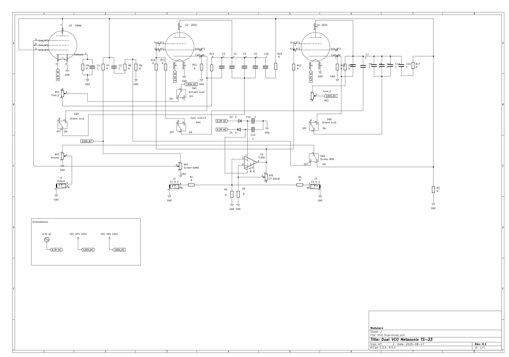
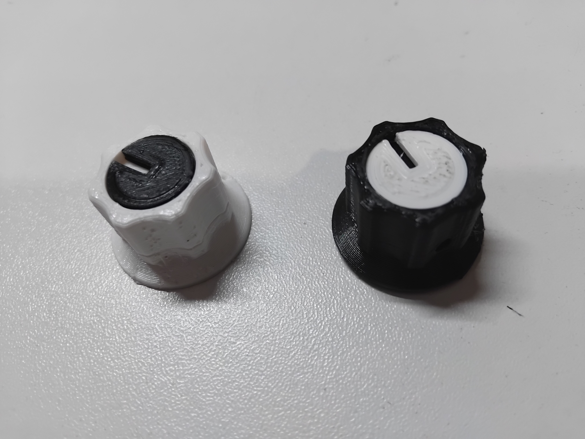

# TS01 - Dual VCO

The first one !! Whoooooohooooo :)
I'll describe all my journey of tube's noob :)

You'll find here my work in progress like a prototype :)

Maquette A et B C 0.1 et 0.2

Maquette V 0.1
My traveling companion wanted to get an idea of what it would look like.
I made a mock-up front panel and decided on a position for the tube. Wood, hot glue...

Quick and dirty :)

We agreed that it was a feasible project.

So I made a prototype using Dibond.
A reliable support for the tubes is needed.
I thought that perhaps with a second support I would have more space to put the components.

I realized that there wouldn't be enough space to make a clean assembly, so I opted for the rear side.

Paper stuck on the dibond

Tube holder

More space for the components ?

## 1 - Choices : 

Tube modules take up space because everything is bulkier. In addition to the tubes, best practice dictates that you use 1W resistors, 400V capacitors, and thick wires :)

Very often, tube amplifiers do not use PCBs, but rather a direct connection between the components and the tube holder.

Some people are very particular about the wiring :D
With well-designed wiring, you can read the diagram live, making troubleshooting much easier.

To have enough space to put everything in neatly, I opted for a “back panel.”
It will hold the tube holders, all the components, and the connection strips.

Holes placed just above the potentiometers, jacks, and switches will allow the wires from these elements to be routed to the back panel.

## 2 - Front et Back panel : 

Want to make your own front panel ? : https://github.com/dubhalley/Front_Panel

Front Panel

Back panel

Files : 

Front panel : 

Rear panel : 

Define the position of your jacks, pots, switches, tubes, etc.

Try to keep in mind what each component is connected to in order to optimize the wiring.

There will be visible screws on the front panel to secure the rear panel in parallel with spacers.

I used the .svg file from the front panel to make the rear panel, so I have all my hole positions exactly right ;) 

## 3 - Schéma : 

I used this diagram: 

I redid it with Kicad, trying to anticipate the wiring.

Kicad diagram: 

With the symbols for kicad :

But, looking back, I think I could have done better...
I followed the original diagram too closely.
It's the first one ... beginner errors :)
Next time ... ;)

I created an .svg file with the component footprints to anticipate the wiring.

Rear panel wiring: 

## 4 - Knob : 

Want to make your own knob ? : https://github.com/dubhalley/Knob

For the knobs, I made a small improvement by digging a small recess on the top, so I can put a colored washer in it to get a position slider.

Files :

Knob : 

Hat : 

## 5 - Case : 

Want to make your own case ? : https://github.com/dubhalley/Case

## 6 - Power supply : 

