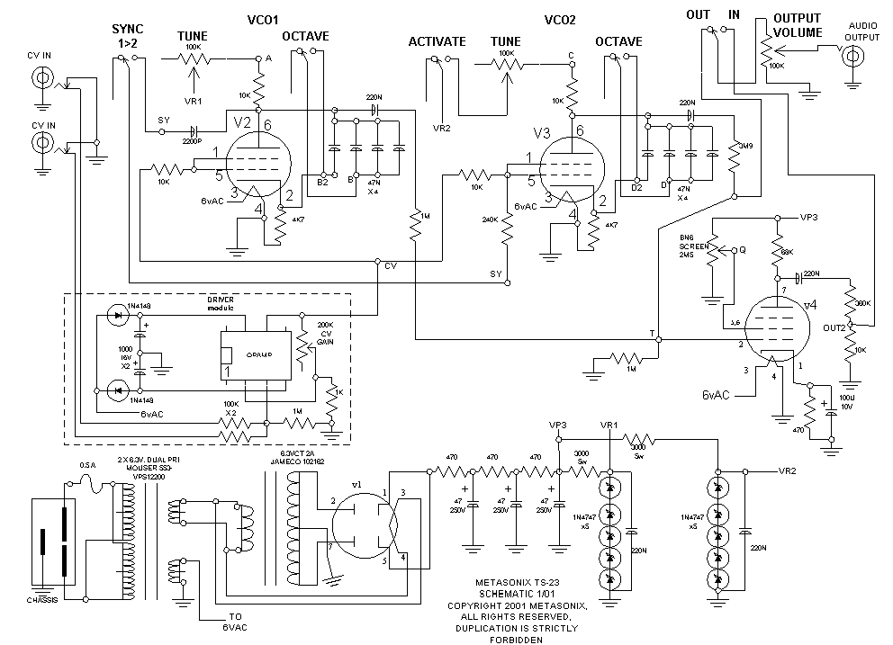

# TS01 - Dual VCO

The first Whoooooohooooo :)
I'll describe all my journey of tube's noob :)

How to start ??

## 1 - Choices : 

Tube modules take up space because everything is bulkier. In addition to the tubes, best practice dictates that you use 1W resistors, 400V capacitors, and thick wires :)

Very often, tube amplifiers do not use PCBs, but rather a direct connection between the components and the tube holder.

Some people are very particular about the wiring :D
With well-designed wiring, you can read the diagram live, making troubleshooting much easier.

To have enough space to put everything in neatly, I opted for a “back panel.”
It will hold the tube holders, all the components, and the connection strips.

Holes placed just above the potentiometers, jacks, and switches will allow the wires from these elements to be routed to the back panel.

## 2 - Front et Back panel : 

A method to realise front panel : https://github.com/dubhalley/Front_Panel

Define the position of your jacks, pots, switches, tubes, etc.

Try to keep in mind what each component is connected to in order to optimize the wiring.

There will be visible screws on the front panel to secure the rear panel in parallel with spacers.

I used the .svg file from the front panel to make the rear panel, so I have all my hole positions exactly right ;) 

It's a prototype :)

## 3 - Schéma : 

I used this diagram: 

I redid it with Kicad, trying to anticipate the wiring.

Kicad diagram: 

But, looking back, I think I could have done better...

I followed the original diagram too closely.

I created an .svg file with the component footprints to anticipate the wiring.

Rear panel wiring: 

## 4 - Knob : 

Method for making your own knob : https://github.com/dubhalley/Knob

For the knobs, I made a small improvement by digging a small recess on the top, so I can put a colored washer in it to get a position slider.

Knob:

## 5 - Case : 

Method for making your own case : https://github.com/dubhalley/Case

## 6 - Power supply : 

**First of all, I'd like to extend my warmest thanks to Eric Barbour (https://www.metasonix.com/), Rene Schmitz (https://www.schmitzbits.de/), Marc Bareille (http://m.bareille.free.fr/index.htm), Sam Battle (https://www.lookmumnocomputer.com/) and Ken Stone (https://open4umodular.github.io/synthpanel/) for sharing their schemas.**

**But also my dear JM, without whom this project would not be possible.**

